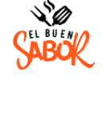

# El Buen Sabor   Comida Rápida

El Buen Sabor es un local de comida rápida ubicado en Mendoza cuya especialidad son las hamburguesas, aunque también vende pizas, papas y bebidas. El local vende a través de su página web y permite retiro en el local y delivery, su público objetivo son personas de entre 16 y 45 años de la provincia de Mendoza que estén dispuestos a desafiar sus paladares.

## Integrantes del grupo:
* [Franco Gonzales](https://github.com/francoGonzalez2706)
* [Emilia Chiófalo](https://github.com/emichiofalo)
* [Sebastián Suliá](https://github.com/Sebass24)

## Boceto en Figma
* [Link a Bocetos en Figma](https://www.figma.com/file/BVRG4kdfS5maWcZeYLyuDa/Entrega-1?node-id=0%3A1&t=OCyDI9J0WTt8hb3l-1)

## Video Explicativo
* [Video](https://youtu.be/G8lAlDrBuuM)

## Presentación proyecto
* [Carpeta grupo FES](https://docs.google.com/document/d/1U7_fRz9dBm-KPtNSss79JvgTtu0m-JRcD5pxB9nMYXY/edit)

